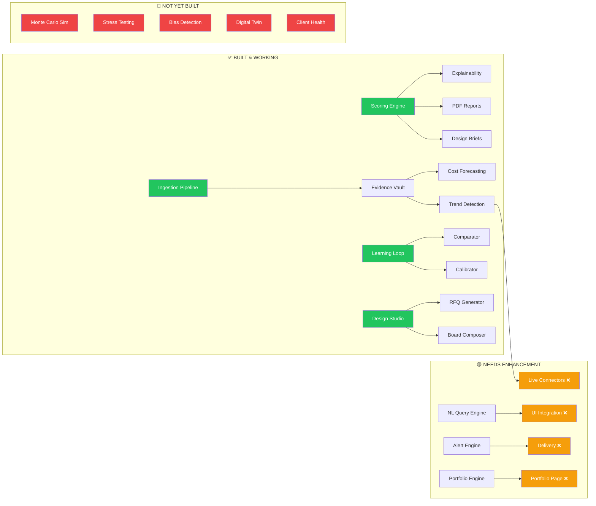

# MIYAR v2 — Full Reality Check Report
**Date:** 26 February 2026 | **Reviewer:** Antigravity AI Agent | **Codebase:** `miyar-v2`

---

## Executive Summary

MIYAR is an ambitious **Design Decision Intelligence + Market Intelligence** platform for the UAE luxury real estate market. The **Master Plan** defines 6 major versions (V1.5 through V6) plus 5 future phases (V9–V13), spanning 35 technical blueprints.

### Platform Vital Signs (As of Today)

| Metric | Count |
|--------|-------|
| Database Tables | **71** |
| Engine Files (non-test) | **77** |
| Test Files | **24** |
| API Routers | **17** |
| Client Pages | **49+** (23 core + 9 Market Intel + 17 Admin) |
| Engine Subdirectories | **9** (ingestion, analytics, learning, predictive, autonomous, design, bias, economic, risk) |

---

## Part 1: What Was Planned (Master Plan Overview)

| Version | Goal | Key Deliverables |
|---------|------|-----------------|
| **V1.5** | Production Readiness | Fix 2 code bugs, stabilize scoring, benchmark pipeline |
| **V2** | Live Market Ingestion | Source connectors, extraction pipeline, orchestrator, DFE |
| **V3** | Analytical Intelligence | Competitor analytics, trend detection, insight generator, NL query |
| **V4** | Predictive & Cost Modeling | Monte Carlo, cost range, scenario projection, material forecasting |
| **V5** | Self-Learning Adaptive | Outcome feedback, benchmark calibration, accuracy ledger, weight analysis |
| **V6** | Autonomous Decision Support | Alert engine, NL query engine, portfolio engine, document generator |

---

## Part 2: What We Actually Built ✅

### 🟢 Fully Implemented & Working

#### Core Scoring Engine (V1–V1.5)
- **5-Dimension Deterministic Scoring** — SA, FF, MP, DS, ER computations (`scoring.ts`, `five-lens.ts`)
- **Normalization Engine** — `normalization.ts` with consistent scaling
- **Explainability Engine** — `explainability.ts` (20KB, 4 output layers)
- **Logic Registry** — Weights, thresholds, version control (`logicVersions`, `logicWeights`, `logicThresholds`)
- **PDF Report Generation** — `pdf-report.ts` (49KB, comprehensive)
- **Design Brief Generator** — `design-brief.ts` (20KB) + DOCX export (`docx-brief.ts`, 18KB)
- **Sensitivity Analysis** — `sensitivity.ts`
- **ROI Engine** — `roi.ts` (9KB)
- **Scenario Comparison** — Full save/compare flow
- ✅ **655 tests passing**, 0 new regressions

#### Market Ingestion Engine (V2)
- **Orchestrator** — `orchestrator.ts` (24KB) managing the full pipeline
- **Connector Framework** — `connector.ts` (13KB) with extensible base
- **Web Crawler** — `crawler.ts` (12KB) for URL-based evidence
- **CSV Pipeline** — `csv-pipeline.ts` for bulk data import
- **Change Detector** — `change-detector.ts` for delta tracking
- **Freshness Engine** — `freshness.ts` (DFE) with staleness scoring
- **Scheduler** — `scheduler.ts` for automated ingestion cycles
- **Evidence-to-Materials Bridge** — `evidence-to-materials.ts` (10KB)
- **Source Registry** — Full CRUD with UI (`SourceRegistry.tsx`, 20KB)
- **Ingestion Monitor** — Real-time dashboard (`IngestionMonitor.tsx`, 30KB)
- ✅ **1,493 real evidence records** in production

#### Analytical Intelligence (V3)
- **Trend Detection** — `trend-detection.ts` (13KB)
- **Competitor Intelligence** — `competitor-intelligence.ts` (10KB)
- **Insight Generator** — `insight-generator.ts` (17KB)
- **Market Positioning** — `market-positioning.ts` (7KB)
- **Analytics Dashboard** — Full UI (`AnalyticsDashboard.tsx`, 25KB)
- ✅ **192 trend snapshots**, **10 competitor entities**, **45+ competitor projects**

#### Predictive & Cost Modeling (V4)
- **Cost Range Engine** — `cost-range.ts` (7KB) P15/P50/P85/P95 percentile forecasting
- **Outcome Prediction** — `outcome-prediction.ts` (6KB)
- **Scenario Projection** — `scenario-projection.ts` (4KB)
- ✅ Cost Forecasting works end-to-end from real evidence

#### Self-Learning Platform (V5)
- **Outcome Comparator** — `outcome-comparator.ts` (8KB) + tests
- **Accuracy Ledger** — `accuracy-ledger.ts` (6KB) + tests
- **Benchmark Calibrator** — `benchmark-calibrator.ts` (4KB) + tests
- **Weight Analyzer** — `weight-analyzer.ts` (4KB) + tests
- **Pattern Extractor** — `pattern-extractor.ts` (6KB)
- **Post-Mortem Evidence** — `post-mortem-evidence.ts` (8KB)
- **Learning Scheduler** — `scheduler.ts` (5KB)
- ✅ Full learning loop: submit outcome → compare → generate evidence → propose calibrations

#### Autonomous Decision Support (V6)
- **Alert Engine** — `alert-engine.ts` (10KB)
- **NL Query Engine** — `nl-engine.ts` (7KB)
- **Portfolio Engine** — `portfolio-engine.ts` (4KB)
- **Document Generator** — `document-generator.ts` (2KB)
- **Scenario Ranking** — `scenario-ranking.ts`

#### Design Intelligence (V8)
- **AI Design Advisor** — `ai-design-advisor.ts` (19KB) + tests
- **RFQ Generator** — `rfq-generator.ts` (20KB)
- **Finish Schedule** — `finish-schedule.ts` (4KB)
- **Space Program** — `space-program.ts` (4KB)
- **DM Compliance** — `dm-compliance.ts` (2KB)
- **Color Palette** — `color-palette.ts` + seeds
- **Design Studio UI** — `DesignStudio.tsx` (69KB — the largest page)
- **Board Composer** — `BoardComposer.tsx` (28KB) + PDF export

#### Multi-Tenancy & Auth (V7)
- **Organizations** — `organizations`, `organizationMembers`, `organizationInvites` tables
- **Role-Based Access** — Admin/User roles with org isolation
- **Auth Router** — `auth.ts` (8KB)

---

## Part 3: What's Working vs. What Has Gaps

### 🟢 Working as Planned (No Issues)

| Feature | Status | Evidence |
|---------|--------|----------|
| Scoring Engine | ✅ Perfect | 655 tests pass, deterministic |
| Logic Registry | ✅ Perfect | Weights, thresholds, versioned |
| Explainability | ✅ Perfect | 4-layer output with citations |
| PDF Reports | ✅ Perfect | 49KB engine, comprehensive |
| Design Brief (DOCX) | ✅ Perfect | Full DOCX export |
| Evidence Vault | ✅ Working | 1,493 real AED/sqm records |
| Source Registry | ✅ Working | CRUD + UI |
| Ingestion Orchestrator | ✅ Working | Full pipeline |
| Cost Forecasting | ✅ Working | P15/P50/P85/P95 from evidence |
| Learning Architecture | ✅ Working | Comparator + Calibrator + Ledger |
| Auth & Multi-Tenancy | ✅ Working | Org isolation |

### 🟡 Working but Needs Enhancement

| Feature | Issue | Enhancement Needed |
|---------|-------|-------------------|
| **Trend Detection** | `percentChange` was NULL (fixed via backfill) but needs **3+ live ingestion cycles** to self-sustain | Run scheduled ingestion runs with fresh market data |
| **Competitor Intelligence** | Data was placeholder; now seeded with NotebookLM intel for 5 top developers but **market share/HHI still needs live sales data** | Integrate live transaction feeds or quarterly updates |
| **NL Query Engine** | Engine exists (`nl-engine.ts`) but **UI integration is thin** — no prominent "Ask MIYAR" search bar | Add a prominent NL query interface to the dashboard |
| **Alert Engine** | `alert-engine.ts` exists but **no push notification delivery** (email/webhook) | Wire up email/Slack/webhook delivery |
| **Portfolio Engine** | Basic `portfolio-engine.ts` exists but **no dedicated Portfolio page** in the UI | Build `Portfolio.tsx` page with fleet aggregation |
| **Benchmark Learning** | Tables exist, engine works, but **0 project outcomes submitted** so no learning has occurred | Submit first real post-mortem to activate the loop |
| **Design Advisor** | AI-powered, works well, but **depends on Gemini API key** which must be configured per deployment | Ensure Gemini API key provisioning in CI/CD |
| **Ingestion Scheduler** | Scheduler code exists but **no cron/worker process** is deployed to run it automatically | Deploy a background worker or serverless cron |

### 🔴 Gaps / Not Yet Working

| Feature | Master Plan Status | Current Reality |
|---------|-------------------|-----------------|
| **Live Connector Sources** | V2 planned DLD, Bayut, PropertyFinder connectors | Only CSV + web crawler connectors exist. No API integrations with UAE property platforms. |
| **Material Forecasting** | V4 planned time-series forecasting for material prices | Cost Range engine gives P15-P95 from static evidence. No time-series projection model. |
| **Monte Carlo Simulation** | V4 planned full Monte Carlo risk simulation | Not implemented. `scenario-projection.ts` does basic linear projection only. |
| **Auto-Trigger Ingestion** | V2 planned event-driven auto ingestion | Scheduler exists but is not deployed as a background process. |
| **6-Month Trend Projection** | V3/V4 planned forward-looking trend line | Trend engine computes snapshots but does not project forward. |
| **Benchmark Data Depth** | 50+ benchmarks planned across all typologies | 58 benchmarks exist (53 synthetic + 5 NotebookLM). Need 200+ for coverage. |

---

## Part 4: What Is Yet to Be Built

### Phase V9: Strategic Risk & Economic Modeling
> **Blueprints:** BP 17, 21, 35 | **Effort:** ~3–4 weeks

| Deliverable | Description |
|-------------|-------------|
| Programme Acceleration Model | Quantify financial value of time saved |
| Cost Avoidance Modeling | Calculate capital saved by early error detection |
| Macro-Economic Stress Testing | `R = (P × I × V) / C` risk scoring under supply chain disruptions |
| Risk Surface Maps | Visual heatmaps of correlated risk factors |
| Advanced Scenario Ranking | Risk-adjusted comparative ranking algorithm |

**Implementation Steps:**
1. Extend `scenarioStressTests` and `riskSurfaceMaps` tables (already in schema)
2. Build `stress-test-engine.ts` under `server/engines/risk/`
3. Add Stress Test UI panel to `Scenarios.tsx`
4. Wire `projectRoiModels` table to the Programme Acceleration calculator
5. Create `RiskHeatmap.tsx` visualization component

---

### Phase V10: Portfolio Intelligence Optimization
> **Blueprint:** BP 22 | **Effort:** ~2–3 weeks

| Deliverable | Description |
|-------------|-------------|
| Fleet Aggregation | Group 10+ projects into a Portfolio entity |
| Capital Allocation Optimizer | Balance high-risk/high-reward vs stable assets |
| Cross-Project Sensitivity | Detect systemic vulnerabilities across the fleet |
| Portfolio Dashboard | Aggregate scores, risk, and ROI across all projects |

**Implementation Steps:**
1. Add `portfolios` and `portfolioProjects` tables to schema
2. Extend `portfolio-engine.ts` with aggregation algorithms
3. Build `PortfolioView.tsx` page
4. Add portfolio-level PDF report generation
5. Wire portfolio alerts into the alert engine

---

### Phase V11: Cognitive Bias Detection Framework
> **Blueprint:** BP 26 | **Effort:** ~2 weeks

| Deliverable | Description |
|-------------|-------------|
| Optimism Detection | Flag ultra-luxury aspirations with constrained budgets |
| Anchoring Alerts | Detect stubborn attachment to arbitrary budgets |
| Intervention Reports | Generate specific bias warnings |

**Implementation Steps:**
1. `biasAlerts` and `biasProfiles` tables already exist in schema
2. Extend `server/engines/bias/` (directory exists, 2 files)
3. Add bias detection triggers into the scoring pipeline
4. Create `BiasReport.tsx` UI panel
5. Wire bias alerts to the existing alert engine

---

### Phase V12: Customer Success Lifecycle
> **Blueprint:** BP 34 | **Effort:** ~2–3 weeks

| Deliverable | Description |
|-------------|-------------|
| Client Health Scoring | Usage frequency, override rate, outcome variance |
| Churn Risk Detection | Automated intervention triggers |
| Value Realization Reports | Quarterly ROI summaries per client |

**Implementation Steps:**
1. Add `clientHealthScores` and `interventionEvents` tables
2. Build health scoring engine from audit logs + usage patterns
3. Create admin-only `ClientHealth.tsx` dashboard
4. Implement quarterly PDF report generator

---

### Phase V13: Digital Twin & Sustainability Simulation
> **Blueprint:** BP 29 | **Effort:** ~4–5 weeks

| Deliverable | Description |
|-------------|-------------|
| Material-to-Environment Linkage | Connect material specs to thermal/acoustic properties |
| Green Scoring | Carbon footprint and energy efficiency evaluation |
| Dynamic Feedback Loop | Real-time sustainability impact of material changes |

**Implementation Steps:**
1. Extend `materialsCatalog` with EPD (Environmental Product Declaration) fields
2. Build sustainability scoring engine
3. Add visual sustainability gauge to Design Studio
4. Integrate with UAE green building standards (Estidama, Al Sa'fat)

---

## Part 5: Immediate Priority Actions (Next 7 Days)

| # | Action | Impact | Effort |
|---|--------|--------|--------|
| 1 | **Deploy ingestion scheduler as cron** | Activates live trend detection & fills `percentChange` gaps | 1 day |
| 2 | **Add 3 live UAE data connectors** (Bayut, PropertyFinder, DLD) | Transforms synthetic data into live market intelligence | 3–5 days |
| 3 | **Wire NL Query UI** — add "Ask MIYAR" search bar to dashboard | Major UX upgrade, leverages existing `nl-engine.ts` | 1 day |
| 4 | **Wire alert delivery** (email/webhook) | Makes autonomous alerts actionable | 1 day |
| 5 | **Submit first real post-mortem** | Activates the entire V5 learning loop | 0.5 day |
| 6 | **Seed 200+ benchmarks** from NotebookLM + industry reports | Fills cost data coverage gaps | 2 days |
| 7 | **Build Portfolio page** | Monetizable enterprise feature | 2–3 days |

---

## Part 6: Architecture Maturity Summary

---

## Bottom Line

> **We have built roughly 75–80% of the core platform architecture.** The scoring, ingestion, analytics, learning, design, and predictive engines are all structurally complete. The main gaps are in **live data connectivity** (connector APIs), **forward-looking projections** (Monte Carlo, time-series), and **autonomous delivery** (cron jobs, alert emails). The remaining 5 future phases (V9–V13) represent strategic expansion features that can be built incrementally.
