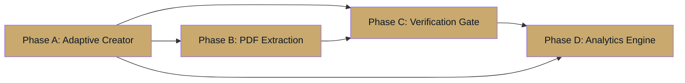

# MIYAR V4 "The Fit-out Oracle" — Deep Analysis & Gap Report

## Executive Summary

Your V4 plan is architecturally sound and addresses a **real market gap**: luxury fitout costing should never price structural voids. After a deep codebase review (~50 files referencing `ctx03Gfa`), here's my analysis per phase, with gaps identified and enhancements proposed.

---

## Phase A: Adaptive Project Creator — Analysis

### ✅ What's Good
- **Three archetypes** (Residential, Office, Villa) maps cleanly to existing `ctx01Typology` enum
- The schema **already has** `unitMix`, `villaSpaces`, and `developerGuidelines` JSON columns — they're currently stubs ready for activation
- `ProjectNew.tsx` is a 7-step wizard (786 lines) that can be extended with archetype-specific steps

### ⚠️ Gaps Identified

| Gap | Impact | Location |
|-----|--------|----------|
| No `totalFitoutArea` column exists in `projects` table | **Critical** — without this, every engine still falls back to `ctx03Gfa` | [schema.ts](file:///Users/amrosaleh/Maiyar/miyar-v2/drizzle/schema.ts#L140-L262) |
| `unitMix` / `villaSpaces` JSON fields have **no typed schema** — they accept any JSON | Medium — data integrity risk | [schema.ts:L253-254](file:///Users/amrosaleh/Maiyar/miyar-v2/drizzle/schema.ts#L253-L254) |
| `ctx01Typology` enum has 7 values but your plan describes 3 archetypes | Medium — need mapping logic | [schema.ts:L165-173](file:///Users/amrosaleh/Maiyar/miyar-v2/drizzle/schema.ts#L165-L173) |
| `ProjectNew.tsx` doesn't conditionally render fields based on typology | High — UI needs archetype-aware steps | [ProjectNew.tsx](file:///Users/amrosaleh/Maiyar/miyar-v2/client/src/pages/ProjectNew.tsx) |
| `FormData` interface in ProjectNew has `unitMix`/`villaSpaces` as raw strings | Medium — needs structured sub-forms | [ProjectNew.tsx:L85-123](file:///Users/amrosaleh/Maiyar/miyar-v2/client/src/pages/ProjectNew.tsx#L85-L123) |
| `project.create` router accepts `unitMix` as optional untyped JSON | Medium — no validation | [project.ts:L69](file:///Users/amrosaleh/Maiyar/miyar-v2/server/routers/project.ts#L69) |

### 🚀 Enhancement Recommendations

1. **Add `projectArchetype` enum** rather than deriving from `ctx01Typology`:
   ```sql
   projectArchetype ENUM('residential_multi', 'office', 'single_villa', 'hospitality', 'community')
   ```
   This decouples typology (what the building IS) from archetype (how MIYAR calculates fitout area).

2. **Add `totalFitoutArea` + `totalNonFinishArea` columns**:
   ```sql
   totalFitoutArea DECIMAL(12,2)    -- sum of all interior finish areas
   totalNonFinishArea DECIMAL(12,2) -- structural voids, columns, risers, etc.
   fitoutAreaVerified BOOLEAN DEFAULT false  -- Phase C gate
   ```

3. **Create typed Zod schemas for unitMix/villaSpaces**:
   ```ts
   const UnitMixSchema = z.array(z.object({
     unitType: z.string(),        // "Type A Studio"
     areaSqm: z.number().min(1),  // 45
     count: z.number().int().min(1), // 20
     includeInFitout: z.boolean().default(true),
   }));
   ```

4. **Office archetype enhancement**: Add a `spaceClassification` field:
   - `shell_core` — excluded from fitout (developer doesn't finish)
   - `common_area` — lobby, corridors, amenities (finished by developer)
   - `tenant_space` — included only if "Cat A/B fitout" is selected

5. **Villa archetype**: Consider adding a `floorLevel` grouping:
   ```ts
   { floor: "Ground", rooms: [{name: "Majlis", areaSqm: 65}, {name: "Dining", areaSqm: 42}] }
   ```

---

## Phase B: Vector PDF Area Extraction — Analysis

### ✅ What's Good
- Leveraging Gemini 2.0 Flash vision for text extraction is pragmatic — avoids heavy BIM dependencies
- Visual polygon highlighting is excellent for trust-building
- The existing `projectAssets` table (with `category: "brief"`) already supports PDF uploads

### ⚠️ Gaps Identified

| Gap | Impact | Location |
|-----|--------|----------|
| No PDF processing infrastructure exists in the codebase | **Critical** — needs new engine | N/A (new) |
| No `projectAssets` category for "architectural_plan" | Low — easy enum extension | [schema.ts:L488-502](file:///Users/amrosaleh/Maiyar/miyar-v2/drizzle/schema.ts#L488-L502) |
| `generatedVisuals` table doesn't have a type for "area_extraction_preview" | Low — needs new enum value | [schema.ts:L558](file:///Users/amrosaleh/Maiyar/miyar-v2/drizzle/schema.ts#L558) |
| No Gemini vision integration exists for document analysis (current Gemini usage is text-only + image generation) | Medium — needs new API wrapper | [invokeLLM](file:///Users/amrosaleh/Maiyar/miyar-v2/server/_core/llm.ts) |

### 🚀 Enhancement Recommendations

1. **Don't use `pdf-lib`** — it only manipulates PDFs, it can't extract spatial data. Instead:
   - **Primary**: Gemini 2.0 Flash with vision — send page images with a structured extraction prompt
   - **Fallback**: `pdf.js` (Mozilla) for basic text-layer extraction when the PDF has embedded text

2. **Add a two-pass extraction pipeline**:
   - **Pass 1 (Text layer)**: Extract text annotations like "Dining Room: 42.5 sqm" using regex
   - **Pass 2 (Vision)**: Send the floor plan image to Gemini with a prompt: *"Identify all labeled rooms with their area tags. Return JSON: [{name, area_sqm, floor, boundary_polygon}]"*
   - **Merge**: Cross-validate Pass 1 and Pass 2 results, flag conflicts for human review

3. **Create a new table `pdf_extractions`**:
   ```sql
   CREATE TABLE pdf_extractions (
     id INT PRIMARY KEY,
     projectId INT NOT NULL,
     assetId INT NOT NULL,            -- FK to projectAssets
     pageNumber INT,
     extractionMethod ENUM('text_layer', 'vision_ai', 'manual'),
     extractedRooms JSON,             -- [{name, areaSqm, confidence, polygon}]
     status ENUM('pending', 'extracted', 'verified', 'rejected'),
     verifiedBy INT,
     verifiedAt TIMESTAMP,
     createdAt TIMESTAMP
   );
   ```

4. **Confidence scoring per room**: Each extracted area should have a confidence score (0-1). Flag anything below 0.8 for mandatory human review.

5. **Consider cost**: Gemini vision API calls for multi-page PDFs can be expensive. Add a page limit (e.g., max 20 pages) and preview before processing.

---

## Phase C: Developer Verification Gate — Analysis

### ✅ What's Good
- "Area Audit" step is the right approach for lender-grade trust
- Keeping `draft_area_verification` until manual confirmation is sound
- Edit + Confirm per extracted area gives appropriate granularity

### ⚠️ Gaps Identified

| Gap | Impact | Location |
|-----|--------|----------|
| `projects.status` enum doesn't include `draft_area_verification` | **Critical** — needs schema migration | [schema.ts:L146-154](file:///Users/amrosaleh/Maiyar/miyar-v2/drizzle/schema.ts#L146-L154) |
| `approvalState` enum exists but is for design approval, not area verification | Medium — need separate gate | [schema.ts:L157-162](file:///Users/amrosaleh/Maiyar/miyar-v2/drizzle/schema.ts#L157-L162) |
| No `auditLogs` action type for "area_verification" | Low — easy to add | [existing audit system](file:///Users/amrosaleh/Maiyar/miyar-v2/server/routers/project.ts#L189) |
| No UI page exists for area verification — would need a new page | High — new frontend work | N/A (new page) |

### 🚀 Enhancement Recommendations

1. **Extend `projects.status` enum** with a new value:
   ```
   "draft" → "draft_area_verification" → "ready" → "processing" → "evaluated" → "locked"
   ```
   > [!WARNING]
   > Adding enum values to PlanetScale requires careful migration — you cannot reorder enum values. Place `draft_area_verification` between `draft` and `ready`.

2. **Create a `AreaVerification.tsx` page** with:
   - Table: Room Name | Extracted Area (sqm) | Source (Text/Vision/Manual) | Confidence | Status
   - Per-row: Edit button (inline edit), Confirm ✓, Reject ✗
   - Bottom: "Finalize Area Calculation" button (disabled until all rows confirmed)
   - Running totals: Total Fitout Area, Total Non-Finish Area, Fitout Ratio

3. **Add audit trail**: Every area edit should be logged with before/after values, making the verification defensible for lenders.

4. **Add a "Skip Verification" option for manual-entry projects** — if the user typed areas by hand (no PDF extraction), they've already verified them. Don't force a redundant step.

---

## Phase D: Fit-out-Centric Analytics Engine — Analysis

### ✅ What's Good
- Pricing by fit-out area rather than GFA is fundamentally correct for luxury fitout
- Exclusion logic for non-finish areas prevents cost inflation
- FF scoring alignment to "Budget per Fit-out sqm" is a significant accuracy improvement

### ⚠️ Gaps Identified — **This is the most impactful phase**

| Gap | Impact | File(s) Affected |
|-----|--------|-------------------|
| `ctx03Gfa` is referenced in **50+ locations** across the codebase | **Critical** — needs systematic migration | See full list below |
| `computeROI()` hardcodes `totalBudget = gfa * budgetCap` | **Critical** — ROI is wrong without fitout area | [scoring.ts:L383](file:///Users/amrosaleh/Maiyar/miyar-v2/server/engines/scoring.ts#L383) |
| `PricingAnalytics.totalFitoutCostAed` is documented as `costPerSqmAvg * GFA` | **Critical** — comment says GFA but should be fitout area | [design-brief.ts:L13](file:///Users/amrosaleh/Maiyar/miyar-v2/server/engines/design-brief.ts#L13) |
| `deriveScaleBand()` in normalization uses raw GFA thresholds (250K, 800K) | **High** — these thresholds are for GFA, not fitout area | [normalization.ts:L25-30](file:///Users/amrosaleh/Maiyar/miyar-v2/server/engines/normalization.ts#L25-L30) |
| `bias-detector.ts` uses `ctx03Gfa` for budget ceiling calculations | Medium | [bias-detector.ts:L43](file:///Users/amrosaleh/Maiyar/miyar-v2/server/engines/bias/bias-detector.ts#L43) |
| `portfolio.ts` aggregates `totalGfa` across projects for portfolio analytics | Medium | [portfolio.ts:L242](file:///Users/amrosaleh/Maiyar/miyar-v2/server/routers/portfolio.ts#L242) |
| `pdf-report.ts` displays "GFA (sqm)" in reports | Low | [pdf-report.ts:L342](file:///Users/amrosaleh/Maiyar/miyar-v2/server/engines/pdf-report.ts#L342) |
| `ai-design-advisor.ts` injects GFA into AI prompts | Medium | [ai-design-advisor.ts:L127](file:///Users/amrosaleh/Maiyar/miyar-v2/server/engines/design/ai-design-advisor.ts#L127) |
| `explainability.ts` labels `ctx03Gfa` as "Gross Floor Area (sqm)" in the score trace | Low | [explainability.ts:L72](file:///Users/amrosaleh/Maiyar/miyar-v2/server/engines/explainability.ts#L72) |
| **8 test files** hardcode `ctx03Gfa` values | Medium — tests will break | Multiple test files |

### 🚀 Enhancement Recommendations

1. **Don't replace `ctx03Gfa` — add alongside it:**
   - Keep `ctx03Gfa` as the structural GFA (still useful for scale band, portfolio analytics, and property-level comparisons)
   - Add `totalFitoutArea` as the **pricing driver**
   - In `ProjectInputs`, add: `totalFitoutArea: number | null`
   - Create a new function: `getPricingArea(inputs) => inputs.totalFitoutArea ?? inputs.ctx03Gfa ?? 0`

2. **Create a `getPricingArea()` utility** that all 50+ callsites migrate to:
   ```ts
   // server/engines/area-utils.ts
   export function getPricingArea(inputs: ProjectInputs): number {
     return inputs.totalFitoutArea ?? inputs.ctx03Gfa ?? 0;
   }
   export function getStructuralArea(inputs: ProjectInputs): number {
     return inputs.ctx03Gfa ?? 0;
   }
   ```

3. **Update `deriveScaleBand()` thresholds** for fitout area:
   - Current: Small < 250,000 sqm, Medium ≤ 800,000, Large > 800,000
   - These thresholds seem wrong already — 250K sqm is a mega-project! For fitout:
     - Small < 500 sqm, Medium ≤ 5,000, Large > 5,000
   
   > [!CAUTION]
   > The current `deriveScaleBand` thresholds look like they may be in sqft, not sqm, or they're intended for GFA of mega-developments (e.g., a 250K sqm mall). For new fitout-area-driven calculations, calibrate these against actual UAE project sizes.

4. **Non-Finish Area classification table**: Rather than just flagging areas, create a standard list:
   ```
   ALWAYS_EXCLUDED: Elevator shafts, stairwells, risers, structural columns, plant rooms
   CONDITIONAL: Storage rooms (finish only if walk-in closet), parking (finish only if show garage)
   ALWAYS_INCLUDED: All habitable rooms, corridors, bathrooms, kitchens, balconies (if enclosed)
   ```

5. **Portfolio analytics migration**: The portfolio view should show both GFA and Fitout Area columns, with a "Fitout Ratio" (fitoutArea / GFA) as a new KPI.

---

## Cross-Phase Dependencies



> [!IMPORTANT]
> **Phase A and D should be developed in parallel** — the schema changes (totalFitoutArea column, archetype enum) are shared dependencies. Phase B is the most independent and can start after A is complete. Phase C bridges B → D.

---

## Files Requiring Changes (Full Impact Map)

### Schema & Types (Change First)
| File | Change Required |
|------|----------------|
| [schema.ts](file:///Users/amrosaleh/Maiyar/miyar-v2/drizzle/schema.ts) | Add `totalFitoutArea`, `totalNonFinishArea`, `fitoutAreaVerified`, `projectArchetype` columns. Extend `status` enum. Add `pdf_extractions` table. |
| [miyar-types.ts](file:///Users/amrosaleh/Maiyar/miyar-v2/shared/miyar-types.ts) | Add `totalFitoutArea` to `ProjectInputs`. Add `ProjectArchetype` type. |

### Engines (Core Logic)
| File | Change Required |
|------|----------------|
| [normalization.ts](file:///Users/amrosaleh/Maiyar/miyar-v2/server/engines/normalization.ts) | Update `deriveScaleBand()` to use fitout area. Add `fitoutRatio` derived variable. |
| [scoring.ts](file:///Users/amrosaleh/Maiyar/miyar-v2/server/engines/scoring.ts) | Update `computeROI()` to use `getPricingArea()`. Adjust FF to use fitout-based budgetFit. |
| [design-brief.ts](file:///Users/amrosaleh/Maiyar/miyar-v2/server/engines/design-brief.ts) | Update `PricingAnalytics` to use fitout area. Update `generateDesignBrief()` totalBudget calc. |
| [pricing-engine.ts](file:///Users/amrosaleh/Maiyar/miyar-v2/server/engines/pricing-engine.ts) | Add area-aware pricing: cost = benchmarkRate × fitoutArea. |
| [bias-detector.ts](file:///Users/amrosaleh/Maiyar/miyar-v2/server/engines/bias/bias-detector.ts) | Update budget ceiling calc to use fitout area. |
| [explainability.ts](file:///Users/amrosaleh/Maiyar/miyar-v2/server/engines/explainability.ts) | Add `totalFitoutArea` label. Update FF drivers list. |
| [pdf-report.ts](file:///Users/amrosaleh/Maiyar/miyar-v2/server/engines/pdf-report.ts) | Show both GFA and Fitout Area in reports. |
| **[NEW]** `area-utils.ts` | `getPricingArea()`, `getStructuralArea()`, non-finish classification. |
| **[NEW]** `pdf-extractor.ts` | Gemini vision + text layer extraction engine. |

### Routers (API Layer)
| File | Change Required |
|------|----------------|
| [project.ts](file:///Users/amrosaleh/Maiyar/miyar-v2/server/routers/project.ts) | Accept `totalFitoutArea`, `projectArchetype`. Add verification endpoint. |
| [design.ts](file:///Users/amrosaleh/Maiyar/miyar-v2/server/routers/design.ts) | Use `getPricingArea()` in `projectToInputs()`. |
| [design-advisor.ts](file:///Users/amrosaleh/Maiyar/miyar-v2/server/routers/design-advisor.ts) | Update AI prompt to use fitout area. |
| [portfolio.ts](file:///Users/amrosaleh/Maiyar/miyar-v2/server/routers/portfolio.ts) | Add fitout area to portfolio aggregations. |
| [scenario.ts](file:///Users/amrosaleh/Maiyar/miyar-v2/server/routers/scenario.ts) | Use fitout area in scenario inputs. |
| [predictive.ts](file:///Users/amrosaleh/Maiyar/miyar-v2/server/routers/predictive.ts) | Use fitout area for predictions. |

### Frontend (UI)
| File | Change Required |
|------|----------------|
| [ProjectNew.tsx](file:///Users/amrosaleh/Maiyar/miyar-v2/client/src/pages/ProjectNew.tsx) | Archetype-conditional fields. Unit mix builder. Room list builder. PDF upload. |
| **[NEW]** `AreaVerification.tsx` | Area audit table with edit/confirm per room. |
| **[NEW]** `PdfPreview.tsx` | Highlighted polygon viewer for extracted areas. |

### Tests (Must Update)
| File | Needs `totalFitoutArea` Added |
|------|-------------------------------|
| `v28.test.ts`, `v15-e2e.test.ts`, `credibility-fixes.test.ts`, `v11-bias.test.ts`, `v8-design.test.ts`, `v4-explainability.test.ts`, `v15-bugfixes.test.ts`, `scoring.test.ts`, `ai-design-advisor.test.ts` | All 9 test files |

---

## Recommended Implementation Order

| Step | Phase | Estimated Effort | Dependencies |
|------|-------|------------------|--------------|
| 1 | A: Schema + Types | 1 day | None |
| 2 | A: `area-utils.ts` utility | 0.5 day | Step 1 |
| 3 | A: ProjectNew.tsx archetype UI | 2 days | Step 1 |
| 4 | D: Engine migration (50+ callsites) | 2 days | Step 2 |
| 5 | D: Test updates | 1 day | Step 4 |
| 6 | B: PDF extraction engine | 2 days | Step 1 |
| 7 | C: AreaVerification.tsx | 1.5 days | Steps 3, 6 |
| 8 | D: Scoring + FF recalibration | 1 day | Step 4 |
| 9 | Integration testing | 1 day | All |
| **Total** | | **~12 days** | |

---

## Additional Enhancements Not in Your Plan

### 1. 🏗️ Area Efficiency Benchmarking
Add a `fitoutEfficiency` KPI = `fitoutArea / GFA`. Compare against industry benchmarks:
- Residential towers: 70-80% efficiency
- Offices: 65-75%
- Villas: 85-95%
- Hospitality: 55-70%

This becomes a new signal in the **Market Positioning (MP)** dimension.

### 2. 📊 Room-Level Cost Waterfall
Since Phase A gives you per-room areas, generate a **room-by-room cost waterfall chart** in the investor summary. Boards love seeing "Majlis: 850K AED, Master Bedroom: 420K AED" rather than just a total.

### 3. 🔄 Area Version History
Track area changes over time (version 1 from PDF, version 2 after developer edits, version 3 after value engineering). This gives a full audit trail for lender documentation.

### 4. 📱 Mobile-Friendly PDF Upload
Allow developers to photograph floor plans with their phone camera. Gemini vision can extract from photos too, not just PDFs. Add a `phone_capture` extraction method.

### 5. 🧮 Fitout Ratio Alert
If `fitoutArea / GFA < 0.60`, auto-flag the project. This likely means the developer is including too many structural voids, or the GFA is wrong.
