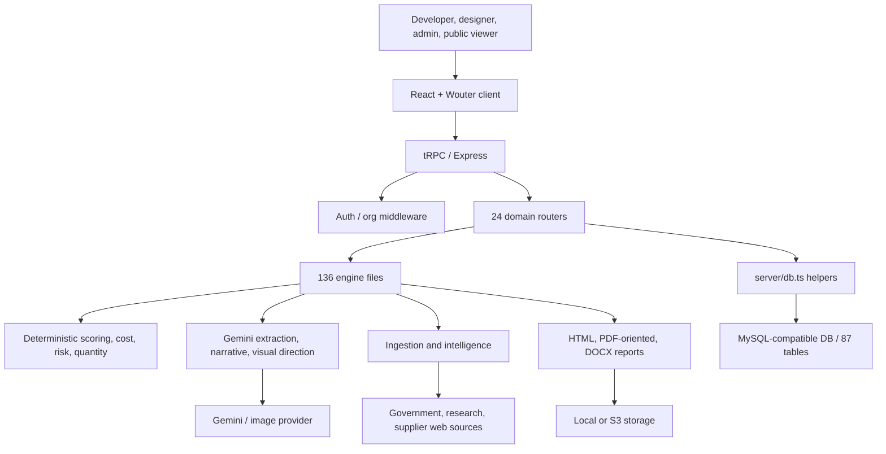
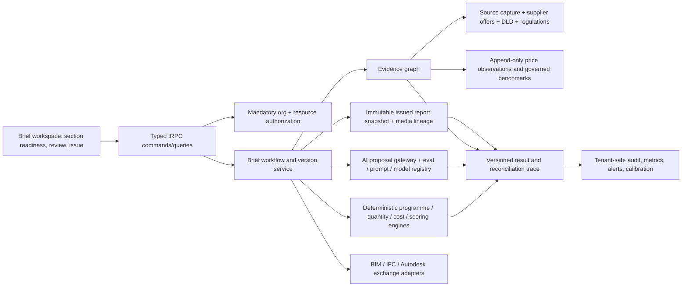

# MIYAR Product, Technical, Data, Design-Intelligence, and Commercial Audit

**Observed:** 15 July 2026
**Repository:** `amosantan/miyar-v2`
**Branch / commit:** `codex/loop-engineering-architecture` / `a15424b` plus the changes listed in this audit
**Decision:** **CONDITIONAL / not production-ready**

This audit is based on the live checkout, live commands, focused browser checks, and current primary or authoritative external sources. Historical phase reports were not accepted as implementation evidence. User-owned migration `0044` files were excluded from inspection-driven changes and remain untouched.

## 1. Executive assessment

MIYAR has the ingredients of a differentiated UAE design-decision product, but its current breadth exceeds its operational trust. The checkout contains 87 schema tables, 24 router modules, 136 engine files, 64 pages, and approximately 97,000 lines of TypeScript/TSX. It attempts intake, deterministic scoring, DLD analytics, materials and quantities, space programming, visualization, scenarios, reports, learning, sustainability, collaboration, and administration. Only 33 test files cover that surface, the full suite is red, TypeScript is red, tenant enforcement is inconsistent, and data truth is not yet strong enough to support the public “live/daily/compliance” positioning.

The strongest defensible product is not “AI generates luxury interiors.” It is:

> **A UAE design-brief decision system that turns developer intent into an approved, typology-aware, costed and evidence-linked brief, then preserves the decisions and assumptions through design handover.**

That wedge is narrower and more commercially credible. It joins a developer’s investment brief to a designer’s space programme, finish intent, procurement guardrails, and board package. MIYAR can differentiate through UAE evidence, deterministic reconciliation, approval states, and report identity—areas where generic renderers and global site-feasibility products are weak.

### What is genuinely strong

- The repository explicitly separates deterministic calculations from AI assistance (`server/engines/scoring.ts`, `normalization.ts`, `design/material-quantity-engine.ts`, `predictive/`).
- The data model already anticipates evidence, source reliability, capture dates, benchmark proposals, logic versions, report instances, space rooms, material allocations, outcome comparisons, and audit records (`drizzle/schema.ts`).
- Intake supports conversational and multimodal paths with an expert-form fallback (`client/src/pages/ProjectNew.tsx`, `server/routers/intake.ts`).
- The design workflow has real building blocks: space programmes, fit-out tags, finish schedules, quantity calculations, material boards, RFQs, DOCX/PDF-oriented reports, DLD analytics, and public brief shares.
- Current DLD open data is a genuine strategic asset: the official transactions dataset is daily and includes transaction/property attributes, while DLD also exposes downloadable real-estate data. [Dubai Pulse DLD transactions](https://www.dubaipulse.gov.ae/data/dld-transactions/dld_transactions-open?organisation=dld&service=dld-transactions), [DLD real-estate open data](https://dubailand.gov.ae/en/open-data/real-estate-data/)

### What prevents production trust

- Several project-scoped routers authenticate a user but do not consistently authorize the project or organization. The audit confirmed this in the learning router and found the same structural pattern across design, scenario, analytics, and other routers.
- Learning and predictive code reads all scores/evidence across organizations (`server/routers/learning.ts:125-171`, `319-365`), creating a cross-tenant contamination risk even after access to the target project is checked.
- `pnpm check` has 49 observed errors; `pnpm test` has 9 failures. A passing build does not compensate for invalid contracts.
- Local development previously connected to the configured remote database and started ingestion, learning, and alert workers automatically. The cron endpoint previously allowed execution when `CRON_SECRET` was absent.
- The landing page claims daily real-time prices, direct/live DLD integration, 50+ localized variations, compliance assurance, and large data counts (`client/src/pages/Home.tsx:142-155`, `322-324`) without runtime evidence sufficient to substantiate those promises.
- Material prices are split across three overlapping models. The primary `material_library` has no source URL, capture time, price validity, quote status, or provenance version (`drizzle/schema.ts:1600-1630`).
- The product journey is fragmented across many global and project routes; there is no single brief completeness/approval contract that tells a user what is ready, insufficient, assumed, or stale.

## 2. Verified baseline

| Area                         | Live evidence                                                                                                                        | Result                                                                                   |
| ---------------------------- | ------------------------------------------------------------------------------------------------------------------------------------ | ---------------------------------------------------------------------------------------- |
| Git                          | Branch `codex/loop-engineering-architecture`, commit `a15424b`; only pre-existing changes were migration `0044` SQL/snapshot/journal | Protected user work identified                                                           |
| Type safety                  | `pnpm check`                                                                                                                         | **FAIL**: 49 errors in client contracts, ingestion, and routers                          |
| Tests                        | `pnpm test`                                                                                                                          | **FAIL**: 9 failed, 799 passed, 22 skipped (830 total)                                   |
| Build, before changes        | `pnpm build`                                                                                                                         | **PASS**; entry bundle 4.76 MB minified / 937 KB gzip                                    |
| Build, after changes         | `pnpm build`                                                                                                                         | **PASS**; entry bundle 678 KB minified / 199 KB gzip                                     |
| Browser                      | `/`, `/login`, unauthenticated `/projects`                                                                                           | Home and login rendered without console errors; protected route redirected to `/login`   |
| Runtime safety               | First local start                                                                                                                    | Connected to configured remote DB and started three worker families; stopped immediately |
| Runtime safety, after change | Second local start                                                                                                                   | Background jobs explicitly disabled in development; no scheduler DB activity observed    |

## 3. Current product and user journey

### Intended-to-implemented journey

1. **Acquire / authenticate.** Public home, methodology, login, registration, then organization creation (`App.tsx`, `Login.tsx`, `server/routers/auth.ts`). The landing page currently sells a luxury-investment platform more than a brief-generation workflow.
2. **Capture intent.** `/projects/new` defaults to AI intake for files, images, audio, URLs, and text, with the structured seven-step `ProjectForm` as fallback. Suggestions are reviewed before project creation.
3. **Establish project facts.** Project detail links to evidence, area verification, space planner, design brief, design studio/advisor, collaboration, explainability, outcomes, and investor summary.
4. **Evaluate.** The project router normalizes inputs, resolves logic/benchmark configuration, runs deterministic scoring, writes score matrices, and derives risk/bias/intelligence outputs.
5. **Develop design direction.** Space programmes and fit-out scope feed finish schedules, MQI surfaces/allocations, color palettes, AI recommendations, boards, visuals, RFQs, and compliance checklists.
6. **Communicate.** Reports, investor PDF, DOCX brief, public share, and collaboration/comments expose portions of the result.
7. **Learn.** Outcomes and post-mortems compare predictions with actuals and create proposed evidence/learning signals.

### Journey deficiencies

- There is no canonical “brief readiness” model across objectives, user groups, typology, spaces, narrative, materials, costs, suppliers, compliance, risks, evidence, and approval. Users navigate features instead of completing a governed brief.
- Project creation asks for scoring variables early, before a clear client/designer brief contract has been established. The value story is therefore “score a project” rather than “align the development and design team.”
- Global routes (`/reports`, `/results`, `/scenarios`, `/portfolio`) and project routes compete for navigation context.
- Approval state exists, but section-level ownership, acceptance criteria, issue resolution, and immutable issued versions do not form a complete workflow.
- Generated concepts are not clearly separated into inspiration, controlled concept, design-development reference, and non-contractual render.

## 4. Current architecture

### Architecture findings

- **Good boundary:** calculation engines are mostly TypeScript and AI is generally used for extraction/narrative/visual work.
- **Weak authorization composition:** `protectedProcedure` proves identity only; many routers then call project/asset/scenario helpers without a mandatory organization-bound resource resolver.
- **God-router pressure:** `server/routers/design.ts` is approximately 1,800 lines and mixes assets, briefs, pricing, visuals, boards, materials, collaboration, DLD, sharing, and floor plans.
- **Data-access inconsistency:** some newer MQI/space helpers require `organizationId`; many older helpers accept only IDs. `projects.orgId` remains nullable for backward compatibility.
- **Dual runtime drift:** Node and serverless entries do not expose identical runtime features. The Node entry owns schedulers, SSE, API docs, request logging, and cron; serverless only mounts auth and tRPC.
- **Observability is partial:** request logs and optional Sentry exist, but Sentry was disabled in the observed environment, and ingestion failures were only logs. There is no verified trace connecting brief generation to evidence/model/prompt/report IDs.
- **Client composition was eager:** all 64 pages and the authenticated shell were statically imported. This audit introduced route/shell splitting.

## 5. Product, data, and design-intelligence assessment

### Typologies and space programmes

The system supports Residential, Mixed-use, Hospitality, Office, Villa, Gated Community, and Villa Development at project level. It has reusable templates and fit-out classification, but retail is not a first-class project typology despite being in the intended product. Apartment, residential-building, hotel, serviced-apartment, restaurant/F&B, workplace, and retail subtypes need explicit parameter sets rather than generic labels. Space logic should produce a reconciled schedule of accommodation with net/gross definitions, unit counts, occupancy assumptions, area source, fit-out responsibility, and variance against a named benchmark.

### Materials, suppliers, and price intelligence

MIYAR has useful quantity formulas and allocations, but three material systems (`materials_catalog`, `material_library`, `material_constants`) invite category/unit drift. Current price truth should be a time-versioned observation, not mutable columns on a product row. Official retail listings such as Danube Home expose AED prices and pack areas, which are useful as retail observations but not tender rates. [Danube Home tile listings](https://www.danubehome.com/ae/en/c/search/tiles-and-bricks) Manufacturer catalogs such as RAK Ceramics are stronger for specification identity than price. [RAK Ceramics UAE](https://www.rakceramics.com/uae/en/) Dubai Municipality’s certified-product lists can validate product/certification status and expiry, not commercial price. [Dubai Municipality certified products](https://www.dm.gov.ae/municipality-business/list-of-certified-products-under-the-factory-assessment-scheme-2/)

The target source ladder should be: signed supplier quote > contracted rate card > supplier/e-commerce observation > governed market benchmark > labelled assumption. Each price must retain incoterm/delivery geography, VAT inclusion, supply-only vs installed, pack conversion, waste, minimum order, lead time, capture time, validity, and evidence URL/file.

### Scoring and explainability

The deterministic five-dimension engine and contribution traces are directionally sound. The principal gap is not another score—it is authority and calibration. A board must see which inputs are explicit, inferred, benchmarked, or assumed; which logic and benchmark versions ran; how penalties reconcile; and whether the output is calibrated against comparable completed projects. No weights, thresholds, or financial assumptions were changed in this audit.

### AI quality and visual intelligence

Gemini structured outputs are the right direction for intake and recommendation contracts; Google explicitly supports schema-constrained structured output and native image generation/editing. [Gemini structured outputs](https://ai.google.dev/gemini-api/docs/structured-output?lang=rest), [Gemini image generation](https://ai.google.dev/gemini-api/docs/image-generation) The missing layer is evaluation: golden multimodal fixtures, field-level precision/recall, abstention tests, conflict preservation, prompt/model identity, visual consistency tests, and human acceptance rates. A render must be linked to room geometry source, material allocation version, prompt/model, seed/reference images, and a conspicuous “concept—not construction information” status.

### Compliance and sustainability

MIYAR should provide a jurisdiction-aware evidence checklist, not “ensure compliance.” Dubai Building Code defines minimum health, safety, accessibility/convenience, environment, and sustainable-development requirements. [Dubai Building Code](https://www.dm.gov.ae/municipality-business/planning-and-construction/dubai-building-code-2/) Al Sa’fat replaced the prior green-building system and requires at least Silver for new Dubai buildings, with higher voluntary ratings. [Al Sa’fat](https://www.dm.gov.ae/municipality-business/al-safat-dubai-green-building-system/) Abu Dhabi uses Estidama/Pearl, and UAE fire/life-safety requirements are maintained through Civil Defence. [Estidama Pearl system](https://www.dmt.gov.ae/-/media/Project/DMT/DMT/E-Library/0001-Manuals/PRRS/PRRS-Version-10.pdf), [UAE Fire and Life Safety Code](https://www.dcd.gov.ae/portal/en/item/82-uaeslscp.jsp?print=1&tmpl=component)

## 6. Competitor and tooling comparison

| Product / source          | Proven strength                                                                                                                                                                                                                                                                                           | Gap relative to MIYAR opportunity                                                        | Implication                                                                                                                                                                                                       |
| ------------------------- | --------------------------------------------------------------------------------------------------------------------------------------------------------------------------------------------------------------------------------------------------------------------------------------------------------- | ---------------------------------------------------------------------------------------- | ----------------------------------------------------------------------------------------------------------------------------------------------------------------------------------------------------------------- |
| **TestFit**               | Editable site plans, constraints, generative options, pro forma, takeoffs, scheme comparison, Revit/CAD/SketchUp/Excel/PDF exports. [TestFit](https://www.testfit.io/), [Site Solver](https://www.testfit.io/product/site-solver)                                                                         | Primarily site/deal feasibility and North American data, not UAE interior-brief evidence | Do not imitate its whole site solver. Match its rapid option comparison and downstream exports at the interior-brief level.                                                                                       |
| **Autodesk Forma**        | Geolocated concept/site analysis, environmental analysis, collaborative review, Revit continuity; advertised from US$59/month. [Forma Site Design](https://www.autodesk.com/products/forma)                                                                                                               | Broad AEC ecosystem, not UAE material/procurement intelligence                           | Integrate rather than compete on geometry. Autodesk Data Exchange/AEC APIs can supply versioned BIM properties and quantities. [APS Data Exchange](https://aps.autodesk.com/developer/overview/data-exchange-api) |
| **Chaos Enscape / Veras** | CAD/BIM-linked visualization, live design iteration, AI image exploration, cloud review, high-quality assets. [Enscape features](https://www.chaos.com/enscape/features), [Chaos 2026 workflow](https://www.chaos.com/press/chaos-strengthens-end-to-end-architectural-design-and-visualization-workflow) | Visualization is the product; cost/provenance/brief governance is secondary              | MIYAR should orchestrate approved material/brief context into visual tools, not attempt to replace professional render workflows.                                                                                 |
| **DLD / Dubai Pulse**     | Official daily transactions and downloadable market records. [Dubai Pulse](https://www.dubaipulse.gov.ae/data/dld-transactions/dld_transactions-open?organisation=dld&service=dld-transactions)                                                                                                           | Property market evidence, not design specification or fit-out cost                       | Build governed area/tier comparables and freshness SLAs; never imply DLD validates interior price premiums without calibrated evidence.                                                                           |
| **RICS NRM / ICMS**       | Standardized order-of-cost/cost-plan measurement and comparable cost/carbon classification. [RICS NRM](https://www.rics.org/profession-standards/rics-standards-and-guidance/sector-standards/construction-standards/nrm), [ICMS 3](https://icms-coalition.org/the-standard/)                             | Standards, not workflow software                                                         | Align cost breakdown/export terminology and declare conformity scope; retain MIYAR-specific interior detail beneath standard classifications.                                                                     |
| **ISO 19650 / openBIM**   | Versioned, organized information containers and lifecycle information management; IFC/IDS/openCDE APIs. [ISO 19650-1](https://www.iso.org/standard/68078.html), [buildingSMART openBIM](https://www.buildingsmart.org/about/openbim/)                                                                     | Frameworks require implementation discipline                                             | Treat issued briefs, boards, schedules, and evidence as versioned information containers; use IFC/IDS or Autodesk exchange for design handoff.                                                                    |

## 7. Complete prioritized enhancement matrix

Effort is relative: **S** <= 1 engineer-week, **M** 2-4 weeks, **L** 1-2 quarters, **XL** multi-quarter. Value is expected user/commercial value after dependencies are met.

| Priority | Class                  | Gap                                                    | Repository evidence                                                                                                                              | User impact                                                              | Recommended solution / technical design                                                                                                                                | Dependencies                                                                | Effort | Risk                         | Expected value        | Objective verification                                                                                                                                                                                                        |
| -------- | ---------------------- | ------------------------------------------------------ | ------------------------------------------------------------------------------------------------------------------------------------------------ | ------------------------------------------------------------------------ | ---------------------------------------------------------------------------------------------------------------------------------------------------------------------- | --------------------------------------------------------------------------- | -----: | ---------------------------- | --------------------- | ----------------------------------------------------------------------------------------------------------------------------------------------------------------------------------------------------------------------------- |
| P0       | Foundation             | Project resources lack mandatory tenant authorization  | `protectedProcedure` only checks identity; numerous `design.ts`, `scenario.ts`, `analytics.ts` procedures accept raw IDs; learning gap confirmed | Cross-tenant disclosure or mutation; unacceptable enterprise risk        | Create typed `orgProjectProcedure`/resource resolvers; require org-bound joins for project, asset, brief, scenario, report, board, visual, comment; add negative tests | Resource ownership map                                                      |      L | Medium migration/legacy risk | Critical              | Automated unauthenticated, cross-org, same-org tests for every project-scoped procedure; query audit finds no raw-ID path                                                                                                     |
| P0       | Foundation             | Cross-tenant learning/prediction contamination         | `learning.ts:125-171`, `319-365` reads all evidence/scores and project records                                                                   | One client’s outcomes can affect another; weak privacy and calibration   | Partition learning datasets by org; allow only explicitly anonymized/governed aggregate pools; store cohort/data-policy version                                        | Product/data governance approval for pooled learning                        |      M | High                         | Critical              | Fixtures with two orgs prove zero record leakage and stable per-org predictions                                                                                                                                               |
| P0       | Foundation             | Red type/test gates                                    | 49 TS errors; 9 failed tests                                                                                                                     | Unsafe releases and ambiguous contracts                                  | Resolve by failure class; do not weaken assertions; add CI artifact with exact baseline/delta                                                                          | Intended contracts for board annex, space empty state, connector confidence |      M | Low                          | Very high             | `pnpm check`, `pnpm test`, `pnpm build` all exit 0                                                                                                                                                                            |
| P0       | Quick win              | Unsafe local jobs and fail-open cron                   | Reproduced local remote-DB connection/workers; prior conditional cron-secret check                                                               | Accidental shared writes and unauthenticated ingestion trigger           | **Implemented:** dev workers opt-in; cron fails closed; retain production behavior                                                                                     | None                                                                        |      S | Low                          | Critical              | Runtime policy tests; dev log confirms jobs disabled; missing/wrong secret returns 401                                                                                                                                        |
| P0       | Product                | Unsupported public promises                            | `Home.tsx:142-155`, `322-324` claims real-time daily prices, direct DLD, compliance assurance, 50+ variations/counts                             | Trust, legal, and sales credibility risk                                 | Replace with measured capability/freshness language and live metrics sourced from health APIs; legal/privacy/terms pages                                               | Commercial/legal approval for copy                                          |      S | Medium                       | Very high             | Every quantitative/public claim maps to a live metric/source and owner; legal review                                                                                                                                          |
| P1       | Foundation             | No canonical Brief Readiness contract                  | Capabilities live across project, brief, spaces, MQI, boards, reports                                                                            | Users cannot tell what is complete, approved, stale, assumed, or blocked | Add a deterministic readiness engine over versioned section states: missing/assumed/evidenced/reviewed/approved/issued                                                 | Product owner defines required sections per typology                        |      M | Medium                       | Very high             | Typology fixtures yield expected readiness; UI and report agree exactly                                                                                                                                                       |
| P1       | Foundation             | Mutable/unprovenanced material prices                  | `material_library` has min/max but no source/capture/validity; overlapping material models                                                       | False precision and stale budgets                                        | Normalize product identity + append-only price observations + supplier offers/quotes; use source ladder; preserve pack/unit/VAT/install basis                          | **Schema human gate**; source terms                                         |      L | Medium                       | Very high             | Every displayed cost resolves to observation/benchmark/assumption and freshness; unit conversion tests                                                                                                                        |
| P1       | Product differentiator | Typology coverage is labels, not full rule packs       | Retail missing from project enum; generic templates/archetypes                                                                                   | Weak briefs for retail, F&B, hospitality, buildings and mixed-use        | Versioned typology packs: objectives, user personas, space rules, net:gross, adjacency, FF&E, compliance prompts, risk checks, deliverable template                    | Human domain validation                                                     |      L | Medium                       | Very high             | Golden briefs for apartment, villa, residential building, office, hotel, restaurant, retail, mixed-use                                                                                                                        |
| P1       | Foundation             | Report reproducibility incomplete and annex tests fail | Two board-annex failures; report paths span multiple engines; sample HTML committed under public uploads                                         | Board output can omit required design evidence or diverge from screens   | Canonical report snapshot DTO with document ID, project/brief version, logic/benchmark/evidence/model/prompt IDs, issue status, assumptions, disclaimer                | Report contract approval                                                    |      M | Medium                       | Very high             | Data assertions + rendered visual QA for complete/partial/large fixtures; share expiry tests                                                                                                                                  |
| P1       | Quick win              | Initial client payload was 4.76 MB                     | All pages and shell eagerly imported in `App.tsx`                                                                                                | Slow first use, especially mobile/client sites                           | **Implemented:** route and authenticated-shell lazy loading                                                                                                            | None                                                                        |      S | Low                          | High                  | Entry bundle 678 KB / 199 KB gzip; public/login/protected browser checks pass                                                                                                                                                 |
| P1       | Foundation             | Design router is an authorization and change hotspot   | `design.ts` combines ~55 procedures across unrelated resources                                                                                   | High regression/security cost                                            | Split asset, brief, board, visual, material, collaboration, market-context routers behind shared resource guards                                                       | P0 authorization layer                                                      |      M | Medium                       | High                  | Module boundaries; contract tests; no procedure behavior regression                                                                                                                                                           |
| P1       | Data                   | Source freshness/quality is not a product SLA          | Evidence supports capture date/confidence; sources and failures are admin views                                                                  | Client sees “live” without coverage/freshness sufficiency                | Coverage matrix by category/geography/tier/unit; freshness SLA; insufficient-data state; source incident status                                                        | Source strategy and licensing                                               |      M | Low                          | High                  | Dashboard/reports show coverage numerator/denominator and staleness; no live label when SLA fails                                                                                                                             |
| P1       | Design intelligence    | AI quality has no evaluated acceptance baseline        | AI tests cover parsing/failure, not field precision or visual consistency                                                                        | Plausible but wrong inputs/materials/renders                             | Golden multimodal dataset; exact-field F1, abstention/conflict metrics, prompt/model registry, user acceptance/override analytics                                      | Licensed/consented fixtures; evaluation rubric                              |      M | Medium                       | High                  | Versioned eval report with thresholds; regression blocks model/prompt promotion                                                                                                                                               |
| P1       | Compliance             | Checklist can be mistaken for assurance                | Public “ensure” claim; deterministic `dm-compliance.ts` without licensed-professional workflow                                                   | Liability and unsafe reliance                                            | Jurisdiction selector; source/version/last-reviewed field; evidence-only checklist; professional sign-off and exclusions                                               | **Human compliance-policy gate**                                            |      M | High                         | High                  | Dubai/Abu Dhabi fixtures; expired source warnings; signed review state; legal approval                                                                                                                                        |
| P1       | Commercial             | No focused monetization or entitlement model           | Broad feature surface; no billing/entitlement domain found                                                                                       | Difficult sales packaging and costly support                             | Package by workflow outcome: Brief, Intelligence, Portfolio; usage meter for AI/render/data; enterprise SSO/API add-ons                                                | Pricing and margin study                                                    |      M | Medium                       | High                  | Entitlement tests, unit economics dashboard, pilot conversion/time-saved metrics                                                                                                                                              |
| P2       | Product differentiator | No robust BIM/CAD handoff                              | DXF parser exists, but no Revit/IFC/common-data integration                                                                                      | Designer rekeys rooms/materials and loses traceability                   | Export/import typed room/finish/material IDs; pilot Autodesk AEC Data Model/Data Exchange or IFC/IDS                                                                   | Partner credentials/cost review                                             |      L | Medium                       | High                  | Round-trip fixture preserves IDs, quantities, versions, and rejected-field report                                                                                                                                             |
| P2       | Product                | Boards and renders are not controlled design records   | Generated visuals/boards exist, but no stage/status lineage contract                                                                             | Attractive output may not match approved materials/geometry              | Concept lineage object: room/source geometry, allocation version, prompt/model, references, approval status; board issue versions                                      | Brief version model                                                         |      M | Low                          | High                  | Render/board provenance visible; changing allocation marks visual stale                                                                                                                                                       |
| P2       | Procurement            | RFQ lacks quote comparison and substitution workflow   | RFQ generation exists; supplier fields are basic                                                                                                 | Procurement still returns to spreadsheets/email                          | Structured RFQ package, supplier offer import, normalization, alternates, lead-time/availability, commercial exclusions; no external send without approval             | Supplier partnerships; **external-message gate**                            |      L | Medium                       | High                  | Three-quote fixture normalizes basis and flags non-comparable offers                                                                                                                                                          |
| P2       | Collaboration          | Comments are not a full design review workflow         | Comments/approval state exist; project/section ownership is shallow                                                                              | Decisions remain in meetings/chat; weak audit                            | Section assignments, due dates, issues, approvals, issue/close reason, immutable issue transmittal                                                                     | Notification policy                                                         |      M | Low                          | Medium-high           | Role matrix and end-to-end review/issue test                                                                                                                                                                                  |
| P2       | Performance            | Deferred shared chunk still ~911 KB; entry 678 KB      | Post-change build warning remains                                                                                                                | Some authenticated routes remain heavy                                   | Isolate Markdown/diagram renderers behind component-level imports; analyze vendor chunks; add bundle budgets                                                           | Bundle analyzer in CI                                                       |    S-M | Low                          | Medium                | Entry < 300 KB gzip; route budgets; repeat browser smoke                                                                                                                                                                      |
| P2       | Operations             | Node/serverless capability drift                       | `server/_core/index.ts` vs `server/serverless/index.ts`                                                                                          | Deployment-dependent missing features and surprises                      | Explicit deployment profiles/capability health; externalize workers; single authenticated cron contract                                                                | Infrastructure approval before production change                            |      M | Medium                       | High                  | Contract/smoke tests for both builds; health endpoint lists capabilities                                                                                                                                                      |
| P2       | Security/privacy       | No verified data-retention/DSR workflow                | Assets, audio transcripts, generated media, prompts and personal data exist                                                                      | UAE PDPL exposure                                                        | Data inventory, purpose/retention, deletion/export workflow, provider-region and cross-border record                                                                   | **Legal/privacy gate**                                                      |      L | High                         | High                  | DSR/export/delete tests and retention job dry run; privacy review. UAE PDPL requires transparent, purpose-limited, secured processing and data-subject rights. [UAE PDPL](https://uaelegislation.gov.ae/en/legislations/1972) |
| P3       | Experimental           | Outcome-driven premium/yield model is under-evidenced  | Sales premium engine uses rules/benchmarks with limited observed calibration                                                                     | Could overstate commercial return                                        | Research-only cohort model with DLD/property data plus controlled design-quality labels; publish calibration/error, not causal claims                                  | **Financial-assumption gate**, licensed data, sufficient sample             |     XL | High                         | Potentially very high | Out-of-sample calibration, bias/segment analysis, qualified valuation review                                                                                                                                                  |
| P3       | Experimental           | Generative option explosion                            | Public claim of 50+ variations; no decision-quality measure                                                                                      | More images can increase review burden                                   | Generate a small diverse set constrained by approved brief; rank by deterministic compliance/cost/brief fit, with human selection                                      | Visual eval and geometry controls                                           |      M | Medium                       | Medium                | Diversity plus adherence score; user selection time and rework vs baseline                                                                                                                                                    |

## 8. Improved product model

### Core object: the Issued Design Brief

MIYAR should organize the product around one versioned object with ten governed sections:

1. **Intent:** objectives, outcomes, positioning, target users, constraints.
2. **Asset context:** city/jurisdiction, typology/subtype, scale, programme phase, source files.
3. **Space programme:** room/unit schedule, net/gross, occupancy, adjacency, fit-out responsibility, benchmark variance.
4. **Design direction:** narrative, experience principles, style vocabulary, mood and palette.
5. **Specification intent:** room-element finish performance, product/brand examples, alternates, exclusions.
6. **Cost and quantities:** deterministic quantities, price basis, range, waste, contingency boundary, classification.
7. **Supply:** supplier/source, availability, lead time, MOQ, quote/observation validity, substitution strategy.
8. **Risk and compliance evidence:** design/cost/schedule/procurement/market risks and jurisdiction-aware checklist.
9. **Concept media:** boards and visuals with lineage and approval status.
10. **Governance:** evidence, assumptions, confidence, owner, reviewer, version, issue purpose, disclaimer.

Each section has a deterministic state: `missing -> drafted -> evidenced -> reviewed -> approved -> issued`, plus `stale` and `blocked`. AI can draft or suggest; it cannot approve or issue.

### Commercial packaging

- **MIYAR Brief:** per-project or team subscription; intake, programme, direction, basic cost guardrails, issued PDF/DOCX.
- **MIYAR Intelligence:** add governed UAE material/supplier/market evidence, quantities, scenarios, procurement comparisons.
- **MIYAR Portfolio:** enterprise organizations, templates, benchmark governance, outcomes, API/BIM integration, SSO, audit/retention controls.
- **Services/partners:** paid typology-pack setup, benchmark onboarding, supplier catalog normalization, report branding, and workflow integration.

Defensibility comes from the governed UAE evidence graph, approved typology packs, outcome calibration, organization templates, and issued-decision history—not from access to a general image model.

## 9. Target technical and data architecture

Key data contracts:

- `brief_version` and `brief_section_version` are immutable when issued.
- `evidence_item` identifies source, capture, terms, geography, reliability, and confidentiality.
- `product_identity` is separate from `price_observation`, `supplier_offer`, and `governed_benchmark`.
- `calculation_run` stores input hash, engine/logic/benchmark versions, output, reconciliation, and insufficiency reasons.
- `generation_run` stores prompt template/version, model, references, output, safety status, and acceptance/override.
- `artifact_issue` stores exact snapshot, issue purpose, document identity, approvals, disclaimer, and expiry/share policy.
- Organization-owned records carry non-null organization identity; global evidence is explicitly `global`, never “null means maybe global.”

## 10. Implementation phases

The detailed dependency-ordered implementation ledger for Codex and Claude Code is maintained in `.agent/state/ROADMAP.md`; its execution and learning protocol is `docs/runbooks/roadmap-execution.md`.

### Phase 0 — Trust recovery (0-4 weeks)

- Complete resource-level tenant authorization and cross-org negative tests.
- Remove cross-tenant learning/evidence pooling.
- Make TypeScript and tests green; render/verify reports.
- Replace unsupported public claims; add legal/privacy/terms and live freshness indicators.
- Retain the runtime-safety and code-splitting changes delivered by this audit.

### Phase 1 — Brief operating system (1-2 quarters)

- Brief readiness/version/issue model and unified project workspace.
- Approved typology packs for apartment, villa, residential building, office, hospitality, retail, mixed-use.
- Canonical report snapshot and designer/board variants.
- Golden intake/AI evaluation suite.

### Phase 2 — Evidence and procurement moat (1-2 quarters)

- Product identity, price observations, supplier offers/quotes, freshness/coverage SLAs.
- DLD governed pipelines and market-comparable methodology.
- RFQ comparison, substitutions, availability and lead times.
- Cost classification mapped to RICS NRM/ICMS where appropriate.

### Phase 3 — Integration and portfolio scale (2+ quarters)

- Autodesk/IFC/IDS handoff pilot and version reconciliation.
- Enterprise entitlements, SSO, retention/DSR, operational workers, observability/SLOs.
- Calibrated outcomes and optional anonymized aggregate learning only after governance approval.

## 11. Changes implemented in this audit

1. **Tenant guard for learning project resources**
   - Added `server/_core/project-access.ts`.
   - Converted comparison/post-mortem project procedures to `orgProcedure` and required exact `project.orgId` matching before child reads/writes.
   - Added four boundary tests including cross-org, missing, and legacy-null organization cases.

2. **Runtime safety**
   - Added `server/_core/runtime-safety.ts`.
   - Background workers are disabled by default in development; explicit `ENABLE_BACKGROUND_JOBS=true` opts in. Production behavior is preserved.
   - Cron authentication now fails closed when `CRON_SECRET` is missing.
   - Added six policy tests.

3. **Client performance**
   - Converted all page imports and `DashboardLayout` to lazy imports with a common fallback.
   - Entry bundle reduced from 4.76 MB / 937 KB gzip to 678 KB / 199 KB gzip.

No schema, scoring weight, financial assumption, compliance policy, production infrastructure, shared database, deployment, or migration `0044` file was changed.

## 12. Verification evidence

| Verification               | Evidence                                                                                                             |
| -------------------------- | -------------------------------------------------------------------------------------------------------------------- |
| Authorization/runtime unit | `pnpm vitest run server/_core/runtime-safety.test.ts server/_core/project-access.test.ts`: 10/10 pass                |
| Learning regression        | `pnpm vitest run server/_core/project-access.test.ts server/engines/learning/outcome-comparator.test.ts`: 7/7 pass   |
| Production build           | `pnpm build`: pass for client, Node server, and serverless bundle                                                    |
| Browser smoke              | Home and login render; no console errors; unauthenticated `/projects` redirects to `/login`                          |
| Runtime smoke              | Development log states background jobs disabled; no scheduler DB activity after change                               |
| Type-check                 | Still fails with the recorded baseline groups; no errors in changed files                                            |
| Full test                  | `pnpm test`: 9 failed, 809 passed, 22 skipped (840 total); the same nine baseline cases failed and 10 new tests pass |
| Migration protection       | Final Git status retains `0044` SQL/snapshot and journal metadata solely as pre-existing user-owned working files    |

## 13. Remaining risks and human decisions

### Immediate engineering risks

- Tenant authorization remains incomplete outside the learning endpoints fixed here.
- Learning still uses all-organization evidence/scores for comparable data; access is fixed, contamination is not.
- Full check/test gates remain red.
- Entry payload remains above an ideal performance budget, and one deferred shared chunk is ~911 KB.
- Report annex behavior and visual QA remain unresolved.
- Local runtime still uses whichever `DATABASE_URL` is configured for ordinary API requests; a dedicated local/test database profile is still needed.

### Decisions requiring authorized humans

- **Scoring/financial:** any weight, threshold, premium/yield assumption, confidence rule, or benchmark-policy change.
- **Schema/data:** the canonical brief version model, product/price observation schema, non-null organization migration, and anonymized aggregate-learning policy.
- **Compliance/legal:** jurisdiction content, licensed-professional sign-off, disclaimer text, PDPL retention/cross-border processing, privacy/terms pages.
- **Commercial:** target segment, packaging, price points, entitlements, source/API licensing budget, supplier partnerships.
- **External/production:** migrations, deployment topology, background-worker infrastructure, provider changes, outbound RFQs/messages, publication.

## 14. Final conclusion

MIYAR should pause feature expansion and spend its next cycle earning trust: tenant-safe resource access, green gates, truthful claims, canonical brief readiness, and versioned evidence. Once that foundation is real, the combination of UAE market data, typology-aware design briefs, deterministic quantities/costs, supplier evidence, and issued board/designer outputs can be commercially distinctive. Without it, additional renderers, scores, dashboards, and predictors increase surface area faster than defensibility.
